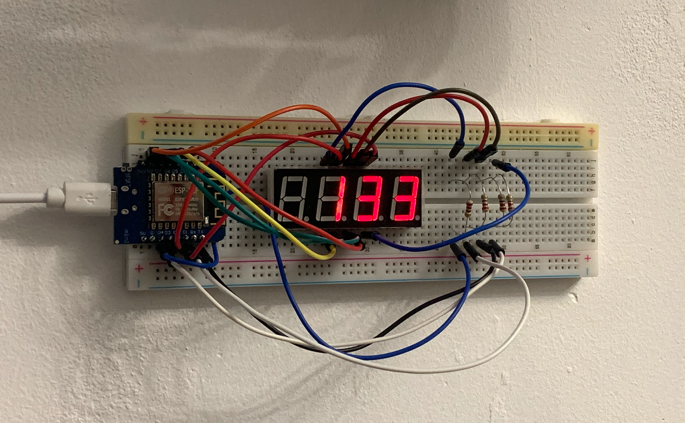

# YouTube Subscribers Display

Simple project to display YouTube channel subscribers count on a 4-digit 7-segment display.

Based on Wemos ESP-12F + 5641AS.



## Features

✓ Automatic connection to local WiFi network
✓ Connection animation on the display
✓ API data request every 5 minutes
✓ Display of subscriber count on the display
✓ Automatic reconnection in case of WiFi disconnection

## Hardware

- **Wemos ESP-12F** - microcontroller with built-in WiFi
- **5641AS Display** - 4-digit 7-segment LED display with common cathode
- **Resistors** - 4 pcs. 220 Ohm (for digits)

### Wiring

Many wires are used for the segments cause no shift register is used.

```
Wemos ESP-12F to 5641AS Display:
  GPIO4 (D2)   ─┬─ A   (pin 7)
  GPIO5 (D1)   ─┬─ B   (pin 3)
  GPIO12 (D6)  ─┬─ C   (pin 4)
  GPIO13 (D7)  ─┬─ D   (pin 12)
  GPIO14 (D5)  ─┬─ E   (pin 1)
  GPIO15 (D8)  ─┬─ F   (pin 8)
  GPIO16 (D0)  ─┬─ G   (pin 10)
  GPIO2 (D4)   ─┬─ 100Ом ─→ D1  (pin 9)  [Digit 1 (thousands)]
  GPIO3 (RX)   ─┬─ 100Ом ─→ D2  (pin 2)  [Digit 2 (hundreds)]
  GPIO1 (TX)   ─┬─ 100Ом ─→ D3  (pin 6)  [Digit 3 (tens)]
  GPIO0 (D3)   ─┬─ 100Ом ─→ D4  (pin 11) [Digit 4 (units)]
```

## Setup

Use VS Code + PlatformIO for development.

Use the `.env` file to store your WiFi credentials and API URL. Copy `.env.example` to `.env` and fill in the values.

```bash
cp .env.example .env
```

API server URL example repo: https://github.com/talyguryn/my-api

## Contributing

Feel free to fork the repository and submit pull requests with improvements or bug fixes. Any contributions are welcome!
